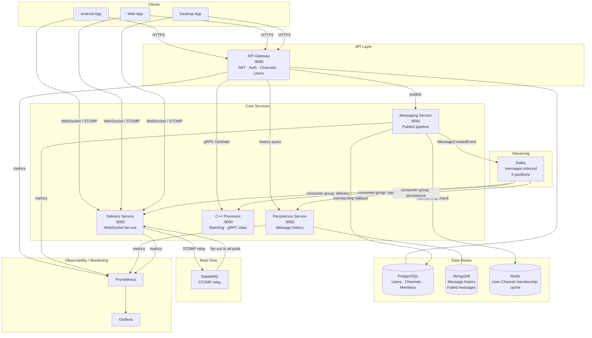
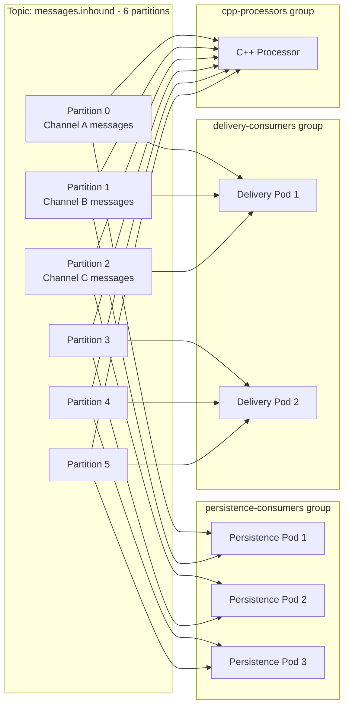
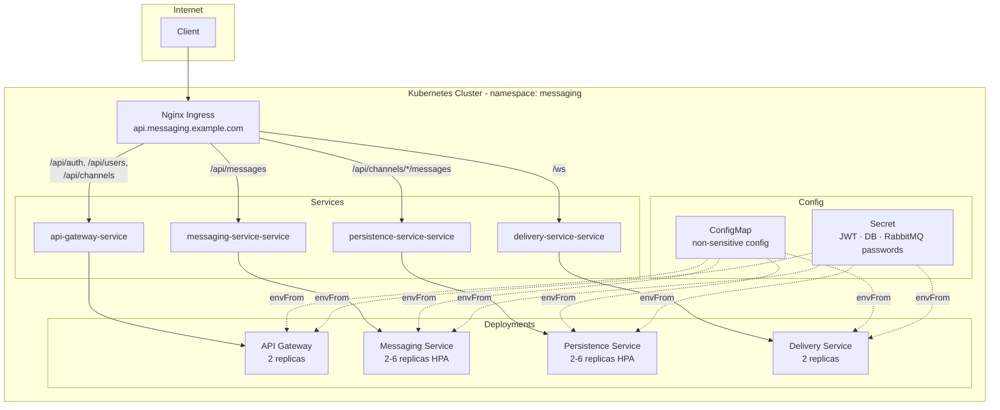
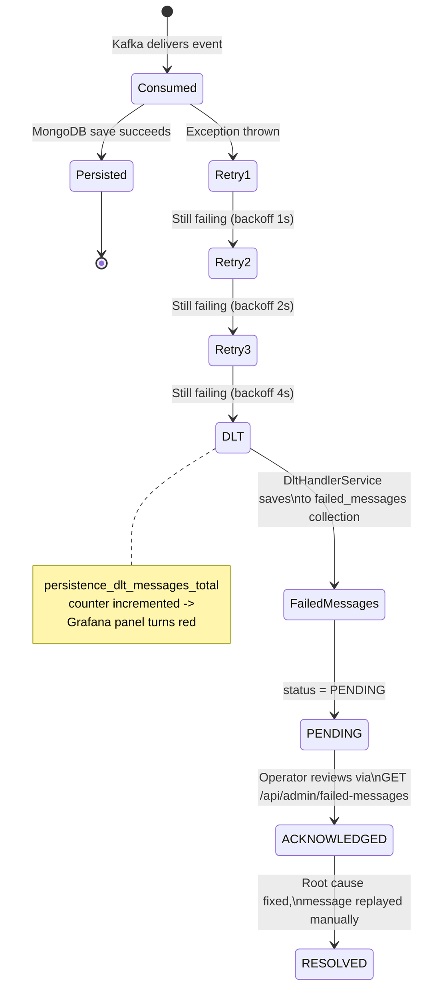

## System Architecture

### Full System Diagram


---

### Message Publish Flow (End-to-End)
```mermaid
sequenceDiagram
    participant C as Client
    participant GW as API Gateway
    participant MS as Messaging Service
    participant RD as Redis
    participant PG as PostgreSQL
    participant KF as Kafka
    participant PS as Persistence Service
    participant MG as MongoDB
    participant DS as Delivery Service
    participant WS as WebSocket Clients
    
    C->>GW: POST /api/messages {channel_id, content}
    GW->>GW: Validate JWT, extract userId
    GW->>MS: Forward request + X-Correlation-Id
    
    MS->>RD: isMember(channelId, userId)?
    alt Cache Hit
        RD-->>: true (~0.1ms)
    else Cache Miss
        MS->>PG: existsByChannelIdAndUserId(channelId, userId)
        PG-->>MS: true (~5ms)
        MS->>RD: cacheMembership(channelId, userId, TTL=5min)
    end
    
    MS->>KF: publish MessageCreatedEvent<br/>(partitionKey=channelId)
    MS-->>C: 202 Accepted {message_id}
    
    par Persistence
        KF->>PS: consume MessageCreatedEvent
        PS->>MG: save Message (id=messageId, idempotent)
    and Delivery
        KF->>DS: consume MessageCreatedEvent
        DS->>WS: STOMP /topic/channels/{channel_id}
    end
```

---

### Kafka Topology


**Ordering guarantee**: All messages for any given channel land on the same partition (`partitionKey = channelId`). 
Kafka guarantees ordering within a partition, therefore consumers see messages in the exact sequence they were published.

---

### Kubernetes Deployment


---

### Dead Letter Topic: Failure Handling
